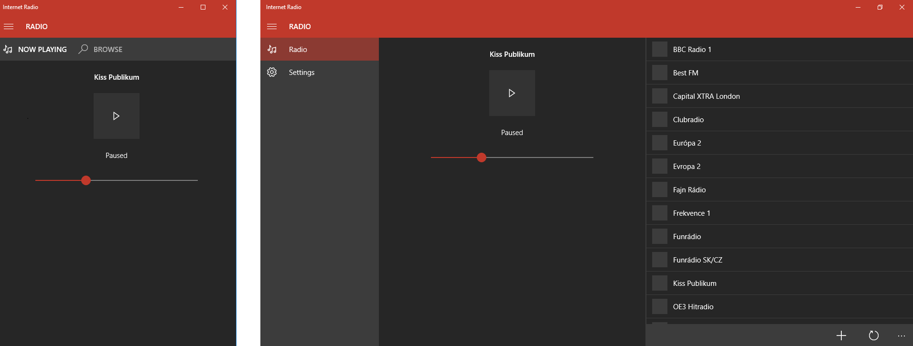
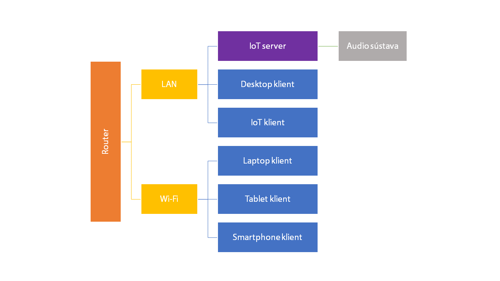
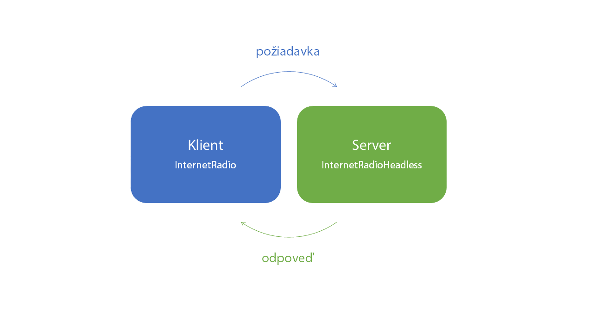
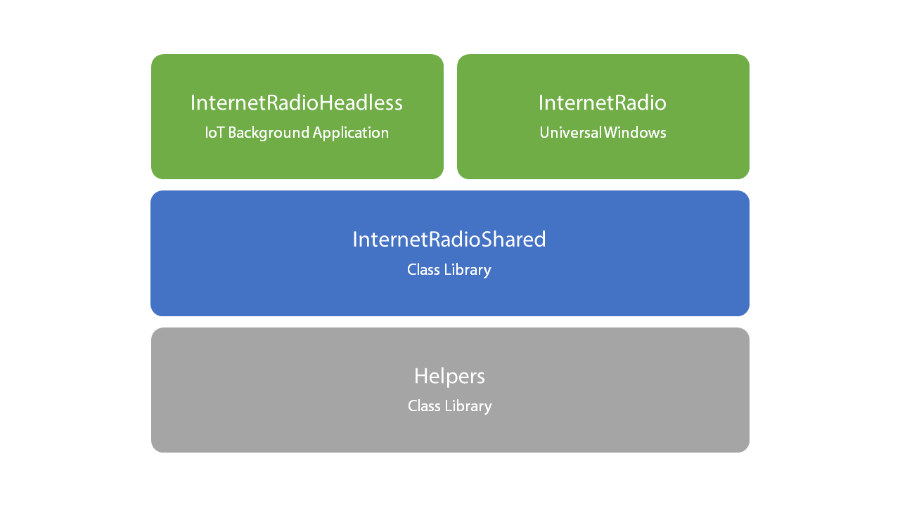
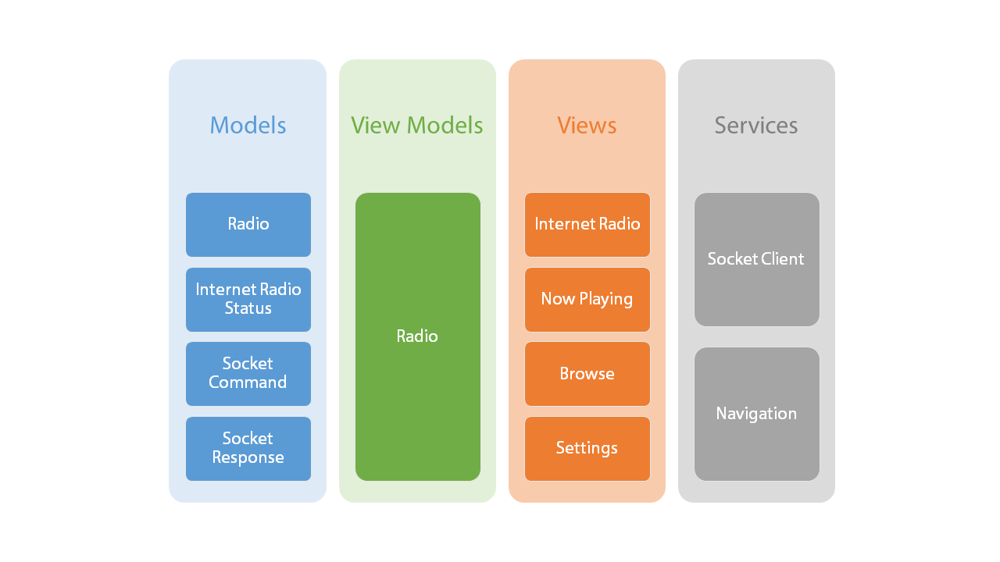
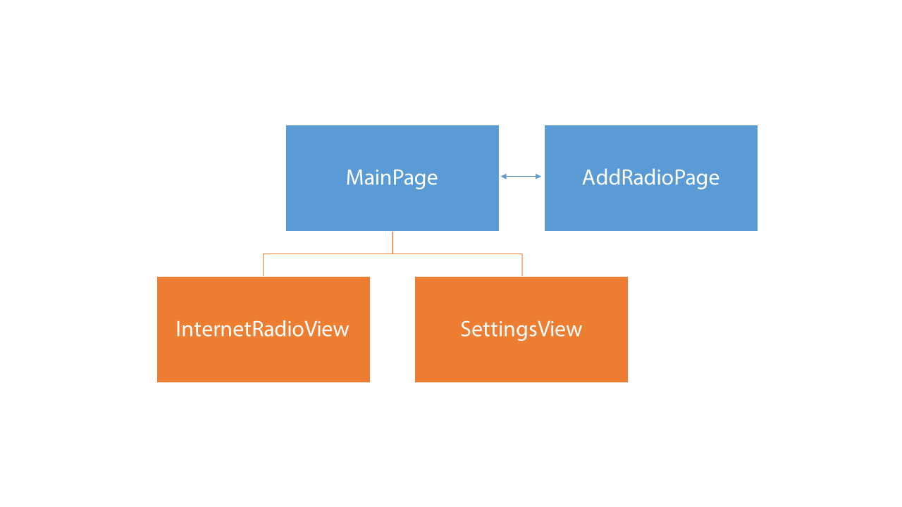

# InternetRadio

This application was part of my bachelor thesis and demonstrates multi-platform application development with Universal Windows Platform.
Application allows you to remotely control internet radio device (RaspberryPi2 with Windows IoT Core) and its settings.

## Demo

## Architecture

### Principle

### Communication

### Solution Architecture

### Client Architecture

### Navigation Architecture

